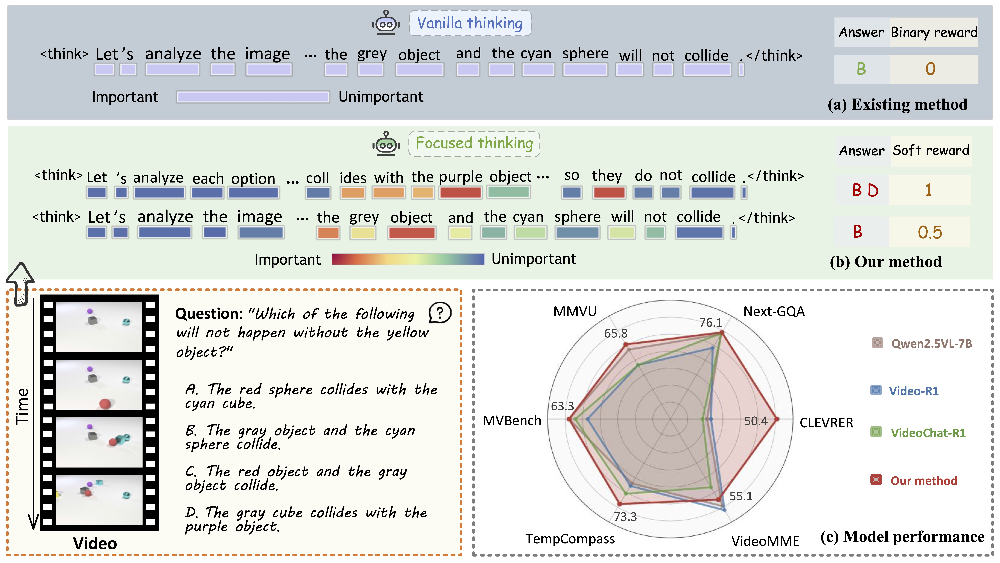
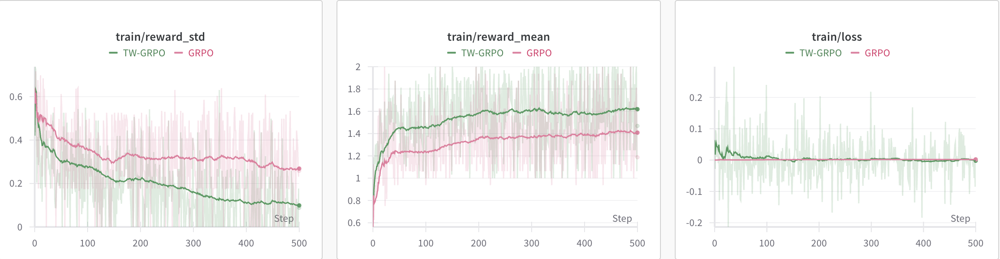
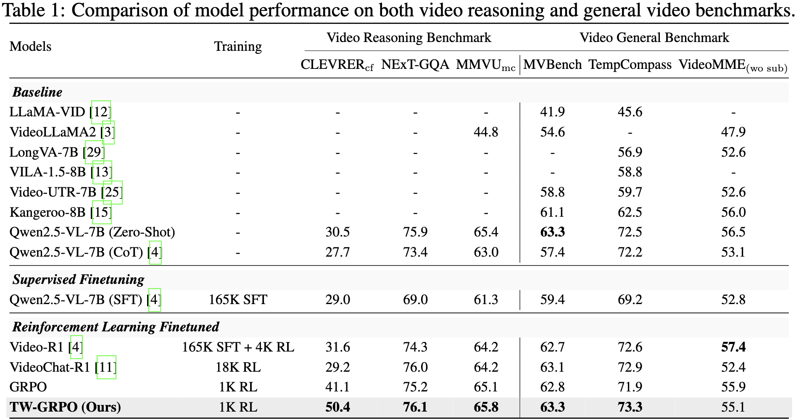

# 🎬 Reinforcing Video Reasoning with Focused Thinking

<p align="center">
        🤗 <a href="https://huggingface.co/Falconss1/TW-GRPO">Model</a> &nbsp&nbsp | &nbsp&nbsp 📑 <a href="https://arxiv.org/abs/2505.24718">Paper</a> &nbsp&nbsp 
</p>

<div align="center">

**🚀 The official repository of our paper "Reinforcing Video Reasoning with Focused Thinking" 🚀**

</div>



**Token-Level Importance Weighting GRPO (TW-GRPO)** integrates **focused thinking** and **soft multi-level rewards** for multi-choice QA. Unlike vanilla thinking which assigns uniform token importance, **focused thinking highlights critical tokens to dominate loss calculation**. By **shifting single-choice QA's binary rewards to multi-choice QA's multi-level rewards**, TW-GRPO enables fine-grained gradient estimation and training efficiency.

## 🔥 Innovation

✨**💫 Entropy-Guided Vision-Language Reasoning**  
To the best of our knowledge, we are the **first pioneers to harness the power of intra-group information entropy within GRPO for elevating video reasoning capabilities in MLLMs**. By **elegantly quantifying token significance through sophisticated entropy-based divergence metrics**, our approach establishes a noval optimization framework that **dynamically spotlights semantically crucial tokens during policy refinement**. This breakthrough innovation illuminates promising pathways toward more efficient, focused, and interpretable reasoning paradigms in multimodal reinforcement learning systems.

## ✨ Highlights

🌟 **🎯 Token-Level Importance Weighting**  
We propose a mechanism prioritizing tokens with **high informational density (estimated by intra-group information entropy)** during loss computation, enabling concise, task-focused reasoning chains.

🌟 **🎨 Multi-grained Reward Modeling**  
Using multi-choice QA tasks with **partial correctness evaluation** to improve gradient estimation and policy stability.

🌟 **🔄 Question-Answer Inverse**  
A data augmentation **converting single-choice QA into multi-choice formats via question negation and answer inversion**, mitigating data scarcity.

<!-- ## 🔍 Overview of Token-Level Importance Weighted Group Relative Policy Optimization (TW-GRPO)


📊 Overview of the TW-GRPO framework. The diagram shows the key steps in a forward pass, starting from the video input, generating possible completions, and calculating the reward with adjustments for the final objective and model updates. Specifically, **🎁 a multi-level soft reward is incorporated into the reward calculation**, providing partial correctness feedback. These signals are then integrated into the final objective, where **⚖️ token-level importance weighting** is applied, allowing the model to prioritize more informative tokens and improve overall performance. -->

## 📈 Comparative Analysis with State-of-the-Art Methods

To better understand the characteristics of our method, we provide case studies comparing reasoning paths between TW-GRPO and [T-GRPO(Video-R1)](https://github.com/tulerfeng/Video-R1) in [`example/performance_comparison.md`](example/performance_comparison.md).

## 🛠️ Set up

> [!NOTE]
> 💻 The training commands below are configured for a node of 2 x H800 (80GB). Training for 500 steps takes approximately 4 hours.

To successfully implement TW-GRPO training, you need to complete the following three essential steps: **dependency installation**, **model backbone download**, and **training dataset download**.

### 🛠️ Step 1: Environment Setup and Dependency Installation
```bash
wget https://github.com/longmalongma/TW-GRPO
cd TW-GRPO
conda create -n r1 python=3.10
conda activate r1
pip3 install -e ".[dev]"
pip3 install flash_attn --no-build-isolation
git clone https://github.com/huggingface/transformers/archive/refs/tags/v4.50.0.zip
cd transformers
pip install .
cd qwen-vl-utils
pip install -e .
pip install decord
cd ..
```

### 📥 Step 2: Download Model Backbone

To download the Qwen2.5-VL-7B-Instruct model, we use the `huggingface_hub` package for quick single-line downloads:

```bash
pip install -U huggingface_hub
huggingface-cli download --resume-download Qwen/Qwen2.5-VL-7B-Instruct --local-dir Qwen/Qwen2.5-VL-7B-Instruct
```

### 🎥 Step 3: Download Training Dataset

#### 🧩 CLEVRER
We use the counterfactual tasks from the CLEVRER dataset as our training data. The JSON files are already saved in [`data/CLEVRER`](data/CLEVRER), but we still need to download the corresponding video data from CLEVRER's official website. You can use the following script for quick setup:

```bash
# Create directories
mkdir -p data/CLEVRER/{train_video,validation_video}

# Download training videos
wget -P data/CLEVRER/train_video http://data.csail.mit.edu/clevrer/videos/train/video_train.zip
unzip data/CLEVRER/train_video/video_train.zip -d data/CLEVRER/train_video
rm data/CLEVRER/train_video/video_train.zip

# Download validation videos
wget -P data/CLEVRER/validation_video http://data.csail.mit.edu/clevrer/videos/validation/video_validation.zip
unzip data/CLEVRER/validation_video/video_validation.zip -d data/CLEVRER/validation_video
rm data/CLEVRER/validation_video/video_validation.zip
```

#### 🌐 General Video Datasets

The test datasets are provided with download links below. Please organize the test data according to the following guidelines. **If you only want to reproduce results on the CLEVRER dataset, you can skip this step.**

| 📊 Dataset | 💾 Size | 🔗 Link |
|---------|------|------|
| [NExT-QA](https://huggingface.co/datasets/lmms-lab/NExTQA) | 11GB | [📥 Download](https://huggingface.co/datasets/lmms-lab/NExTQA) |
| [MMVU](https://huggingface.co/datasets/yale-nlp/MMVU) | 0.9GB | [📥 Download](https://huggingface.co/datasets/yale-nlp/MMVU) |
| [MVBench](https://huggingface.co/datasets/OpenGVLab/MVBench) | 16GB | [📥 Download](https://huggingface.co/datasets/OpenGVLab/MVBench) |
| [TempCompass](https://huggingface.co/datasets/lmms-lab/TempCompass) | 0.4GB | [📥 Download](https://huggingface.co/datasets/lmms-lab/TempCompass) |
| [Video-MME](https://huggingface.co/datasets/lmms-lab/Video-MME) | 94GB | [📥 Download](https://huggingface.co/datasets/lmms-lab/Video-MME) |
| [STAR](https://modelscope.cn/datasets/Video-R1/Video-R1-data/files) | 7GB | [📥 Download](https://modelscope.cn/datasets/Video-R1/Video-R1-data/files) |

> 📝 **Important Notes:**
> - NExT-QA and NExT-GQA share the same video content  
> - MVBench dataset may contain missing videos (refer to [issue #24](https://github.com/tulerfeng/Video-R1/issues/24) for solutions)  
> - JSON files are saved in the [`data/evaluation/`](data/evaluation/) and [`data/CLEVRER/`](data/CLEVRER/):  
>   - nextgqa files are from [VideoChat-R1](https://github.com/OpenGVLab/VideoChat-R1)  
>   - mmvu/mvbench/tempcompass/videomme test files are from [Video-R1](https://github.com/tulerfeng/Video-R1)  
>   - Other JSON files are sourced from their respective dataset websites
> 
> 📁 Please organize the video data in the following directory structure:
> ```
> MMVU/
> ├── videos/
> ├──├──Art/
> ├──├──├──0.mp4...
>
> MVBench/
> ├── clevrer/
> ├──├──video_validation/
> ├──├──├──video.mp4...
>
> NExTQA/
> ├── videos/
> ├──├──video.mp4...
>
> STAR/
> ├── video1.mp4
> ├── ...
>
> TempCompass/
> ├── video1.mp4
> ├── ...
>
> videoMME/
> ├── data/
> ├──├──video1.mp4
> ├──├──...
> ```

### 🏃‍♂️ Training

Once you have prepared the environment, base model, and datasets, you can directly run the following script to train your own TW-GRPO model:

```bash
bash scripts/tw-grpo.sh
```

### ⚙️ Training Configuration Options

Of course, we also provide convenient parameter settings to help you verify the effects of different designs proposed in the paper:

- **❓ Question Type** (`--question_type`):
  - `mixed`: Multi-choice QA tasks (default)
  - `single`: Single-choice QA tasks

- **🔧 Loss Type** (`--losstype`):
  - `grpo`: Standard Group Relative Policy Optimization
  - `tw-grpo`: Token-Level Importance Weighted GRPO (our proposed method)

- **🎚️ Alpha Value** (`--alpha`):
  - Default: 1.70
  - Controls the weight scale of token-level importance
  - Higher values emphasize more important tokens

- **📊 Dataset Selection** (`--jsonl_path`):
  - Path to your dataset JSONL file
  - Example: `evaluation/nextgqa_val_mixed.json`

- **🎁 Reward Function** (`--reward_funcs`):
  - `accuracy`: Multi-level reward (partial correctness)
  - `ori_accuracy`: Binary reward (correct/incorrect only)

### 📊 Training Curves Analysis

The training curves demonstrate TW-GRPO's advantages over classical GRPO:



### 1. ⚡ Higher Training Efficiency
- **📉 Lower reward_std**: TW-GRPO achieves faster reduction in reward standard deviation, indicating:
  - More consistent performance across questions
  - Reduced sensitivity to question difficulty
  - Better generalization through training
- **📈 Higher reward_mean**: Maintains superior average rewards despite lower variance

### 2. 🧠 Improved Reasoning Efficiency
- **💡 Effectively reasoning**: While initial lengths are comparable, TW-GRPO shows:
  - Significant reduction in output length as training progresses
  - Preservation of high reward_mean despite shorter outputs

See [`logs/Qwen2.5-VL-7B-Instruct_clevrer_counterfactual_twgrpo_with_alpha17/`](logs/Qwen2.5-VL-7B-Instruct_clevrer_counterfactual_twgrpo_with_alpha17/) for per-step accuracy and format rewards.

## 📊 Evaluation


> [!NOTE]
> 📝 **Evaluation Information:**
> 1. **📁 Evaluation logs** are available in the [`logs/`](logs/) directory.
> 2. **🔗 External results**: Baseline/Video-R1/Qwen2.5-VL-7B(SFT/CoT) performance on MMVU/MVBench/TempCompass/VideoMME are from [Video-R1](https://github.com/tulerfeng/Video-R1).
> 3. **🎯 Our contributions**: We provide full evaluation logs for:
>    - Qwen2.5-VL-7B(zero-shot)/VideoChat-R1/TW-GRPO on all datasets.
>    - Additional Video-R1 results on CLEVRER/Next-GQA.

After downloading the datasets and completing training, or downloading our model parameters (available at [here](https://huggingface.co/Falconss1/TW-GRPO)), you can evaluate TW-GRPO using the following script:

```bash
bash scripts/evaluate.sh
```
To evaluate baselines, you need to download the model first:
```bash
# For Video-R1 model
huggingface-cli download --resume-download Video-R1/Video-R1-7B --local-dir Video-R1/Video-R1-7B

# For Qwen2.5-VL-7B-COT-SFT model
huggingface-cli download --resume-download Video-R1/Qwen2.5-VL-7B-COT-SFT --local-dir Video-R1/Qwen2.5-VL-7B-COT-SFT

# For VideoChat-R1 model
huggingface-cli download --resume-download OpenGVLab/VideoChat-R1_7B --local-dir OpenGVLab/VideoChat-R1_7B
```

After downloading the datasets, you can evaluate different models using the following scripts:

```bash
# 🎬 Evaluate Video-R1
bash scripts/evaluate_videor1.sh

# 🤖 Evaluate Qwen2.5-VL-7B-COT-SFT
bash scripts/evaluate_qwen2_5vl_sft.sh

# 💬 Evaluate VideoChat-R1
bash scripts/evaluate_videochat_r1.sh

# 🔍 Evaluate Qwen2.5-VL (zero-shot)
bash scripts/evaluate_qwen2_5vl.sh
```

To evaluate other baseline models, you only need to modify the `MODEL_NAME` in the evaluation script.

## 🔄 Question-Answer Inverse (QAI)

QAI is a data augmentation technique that converts single-choice QA into multi-choice QA through question-answer inverse, and we provide a example in [`example/tutorial/qai_tutorial.md`](example/tutorial/qai_tutorial.md) to illustrate this method.

### 🛠️ Implementation
Scripts for QAI conversion are available in:
```bash
python data/question_answer_inverse/convert_nextgqa.py  # For NExT-GQA inversion
python data/question_answer_inverse/convert_star.py     # For STAR inversion
```

  📁 Output files will be generated in the [`data/evaluation/`](data/evaluation/) directory:
- NExT-GQA: `nextgqa_val_mixed.json`
- STAR: `STAR_mixed.json`

## 🙏 References & Acknowledgements
We sincerely thank the contributions from the open source community, including the awesome works of [Open-R1-Video](https://github.com/Wang-Xiaodong1899/Open-R1-Video), [Video-R1](https://github.com/tulerfeng/Video-R1) and [VideoChat-R1](https://github.com/OpenGVLab/VideoChat-R1) etc.

If you find this project useful in your research, please consider cite:
```BibTeX
@article{dang2025reinforcing,
  title = {Reinforcing Video Reasoning with Focused Thinking},
  author    = {Jisheng Dang, Jingze Wu, Teng Wang, Xuanhui Lin, Nannan Zhu, Hongbo Chen, Wei-Shi Zheng, Meng Wang, Tat-Seng Chua},
  booktitle = {arXiv preprint arXiv:2505.24718},
  year = {2025}
}
```

---

<div align="center">

**🌟 Star this repo if you find it helpful! 🌟**

</div>

### 🌟 Star History

[](https://www.star-history.com/#longmalongma/TW-GRPO&Date)